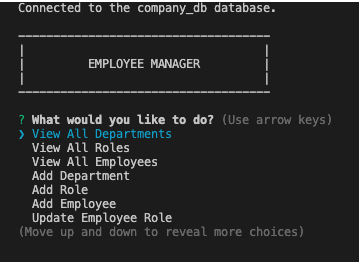
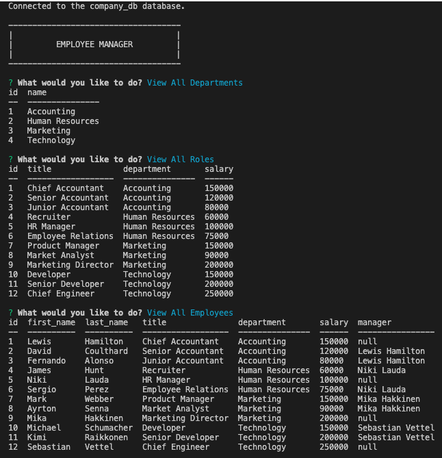

# 12-SQL-Challenge

## Walkthrough Video Link
https://drive.google.com/file/d/19_SXOoTSm9IWvPIOZ1Lzzlgy-ySK97MJ/view

## Link to GitHub Repo
https://github.com/paksin/12-SQL-Challenge

## Description
The challenge is to create interfaces that allow non-developers to easily view and interact with information stored in databases. These interfaces are called **content management systems (CMS)**. The application is a command-line application built to manage a company's employee database, using Node.js, Inquirer, and MySQL.

Application's functionalities include: 

* View all departments

* View all roles

* View all employees

* Add a department

* Add a role

* Add an employee

* Update an employee role

* Update employee managers

* View employees by manager

* View employees by department

* Delete departments, roles, and employees

* View the total utilized budget of a department

## Mock-Up

## Database Schema

